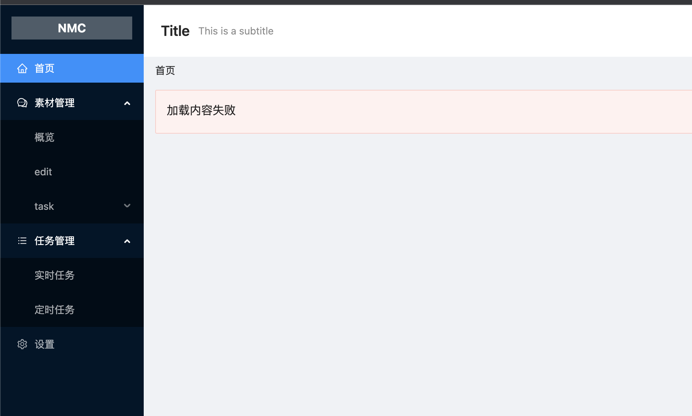
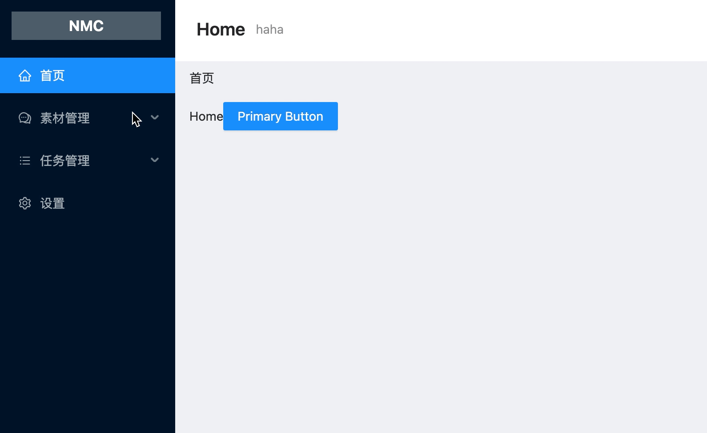
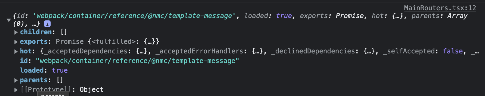

# 选型


[TOC]

## 前端技术栈

| 库/框架                | 版本 | 简介                                                                                                             |
| ---------------------- | ---- | ---------------------------------------------------------------------------------------------------------------- |
| React                  |      |                                                                                                                  |
| Redux                  |      |                                                                                                                  |
| EMP                    |      | 内置了 webpackChain,可以通过链式调用设置 webpack                                                                 |
| connected-react-router |      | 可以通过向仓库派发动作的方式实现路由跳转。每次路径发生变化时可以把最新的路径放到仓库里面，以便随时在仓库中获取。 |
| GraphQL 的引入         |      |                                                                                                                  |
| msw                    |      | [https://mswjs.io/](https://mswjs.io/) 处理 mock 请求                                                            |
| cypress                |      | 前端 E2E 测试框架                                                                                                |

## 知识点延伸

### type 和 interface 的区别

[https://www.cnblogs.com/mengff/p/12936795.html](https://www.cnblogs.com/mengff/p/12936795.html)

### tsx 和 ts 的区分

使用 jsx 时候, 对应文件一定要 tsx 不然会报错

### 私有库搭建,共享工具库 [verdaccio](https://verdaccio.org/)

### emp 框架的使用

[https://emp2.netlify.app/](https://emp2.netlify.app/)
主要帮助实现微前端,代码分离,将静态文件,基础工程等安装至客户服务器,其他模块分发至 CDN,这样则可以保证一些静态文件可由客户管理,一些功能的实时更新,bug 实时修复.
暂无需考虑离线场景

### Webpack federation 模块联邦

### 研究 antd From.item 的实现,如何做到 根据 name 控制

### 研究 react hook form 的实现,如何做到 Controller 的实现

## 解决问题

### Redux 相关

#### [已解决] redux 动态注入

主要是为了实现代码分离,可以在子模块中定义 reducer

#### redux 数据持久化

redux-persist

#### reselect 的使用

[https://www.jianshu.com/p/adfe2b19cd2e](https://www.jianshu.com/p/adfe2b19cd2e)

#### redux 结合 react router

### 引入 JWT 管理

### [已废弃] ~~lerna 的使用~~

替换为 pnpm 方案

### [已完成] 为什么使用 `pnpm` 替换 `lerna`

首先说下 lerna,其实也才接触不久 `monorepo` 的概念,首次尝试 lerna 在一个仓库中管理项目相关的所有包,包括安装依赖,批量执行工作区下包的命令,但是在后续的使用过程中发现 lerna 对 工作空间协议(`workspace:`)依赖的支持不是很好,导致必须将包发布或者在依赖相关包的项目中重新安装包,而使用了 workspace,则可以直接在 packages 目录先更新我的包,相关项目则直接可以使用最新版,加之 lerna 也长期未更新,所以索性就直接换掉了,另外关于包发布方案,看到有`Changesets`可以替代 lerna,由于暂时还没这方面需求,放到以后再研究了.留个 mark [https://blog.csdn.net/qianyu6200430/article/details/121005729](https://blog.csdn.net/qianyu6200430/article/details/121005729)

>

### 本地开发环境的设置

#### 加载 js 报错 404

由于使用了 browser router, 在 url 中,路由看起来更像是普通 url,但是在刷新页面时候,这些 url 会发送给 webpack server,导致访问不到资源,所以,应该设置对其进行设置

开始以为是 historyApiFallback 的设置问题,结果发现,其实已经正常返回默认的 html 只是里面读取的 js 路径是一个相对路径,结果导致未找到 js 才报错,故设置`publicPath`参数即可解决.(参考: [https://github.com/jantimon/html-webpack-plugin#options](https://github.com/jantimon/html-webpack-plugin#options))

```javascript
{
  title: 'Notice Master Client',
  // 远程调用项目的文件链接
  files: {},
  publicPath: '/',
}
```

另外发现使用了相对路径的 api 请求也会面临类似问题,所以应该要尽量避免相对路径的使用,包括静态文件,api 等资源获取.

#### .env 文件的使用

> axios baseUrl 配置

> graphql url 配置

### 路由管理

路由的管理及模块的编排,统一由 navigation 模块完成

#### 添加 not found 路由

在路由最下方,定义一个通配符路由,这样所有未匹配的路由,都可以显示未找到页面,由于未使用根路由,可以将根路由跳转至 home

```javascript
<Route path="/" element={<Navigate replace to="home" />} />
<Route path="*" element={<NotFoundPage />} />
```

### [已完成] 国际化分离管理

主模块负责公共部分翻译内容,每个模块都可以单独定义国际化翻译内容
react-intl 一定要设置为共享的,否则可能出现无法找到对应的 provider

> Uncaught Error: [React Intl] Could not find required `intl` object. <IntlProvider> needs to exist in the component ancestry.

考虑国际化内容清理问题,避免内存泄露

> hrome 内存限制 存在限制 Chrome 限制了所能使用的内存极限(64 位为 1.4GB,32 位为 1.0GB),

[chrome 的内存限制](https://www.cnblogs.com/amiezhang/p/11386600.html)

### [已完成] 创建 axios 实例

可以统一处理请求拦截器,异常处理等

### [已完成] 创建 GraphQL 实例

创建统一 GraphQL,完成一些公共设置

### [已完成] 解决 Warning

Warning: Cannot update a component (`Framework`) while rendering a different component (`Home`). To locate the bad setState() call inside `Home`, follow the stack trace as described in https://reactjs.org/link/setstate-in-render

useInjectReducer 的注入会导致 LanguageProvider 刷新

做了个打印输出,看了下,一次注入居然导致了 3 次页面重新渲染

> 定位了好久的问题,结果发现是 `redux-devtools` 导致的,祭奠我逝去的两晚自由时间

> https://github.com/react-boilerplate/redux-injectors/issues/19#issuecomment-668883407

### 尽可能减少 any 的使用

[规范 TS 项目 Any 类型的使用](https://blog.csdn.net/weixin_43827779/article/details/120343486)

### mock 请求

代码里面使用 msw 完成模拟

### [已完成] 错误边界

可以在远程模块模块加载失败时,避免程序白屏,可以提供一个友好提示


#### 当触发错误边界时,返回正常页面无法清除错误边界内容



> 方案 1: 此处不使用错误边界,调整动态加载可以解决

```js
const TemplateMessageEntry = React.lazy(() =>
  import('@nmc/template-message/entry').catch(() => {
    return { default: () => <>import error</> };
  })
);
```

> 方案 2: 后来发现其实是我将错误边界定义在父容组件上,所以当这个异常触发后,父容器一直显示的错误内容,没有渲染子组件,而我这个子组件是负责页面路由的,最终在子组件上重新定义了错误边界,这样就不影响其他页面了,同时 还必须保证父组件能正常刷新

进一步研究发现,其实还是错误边界设置的层级太高了

before:

```javascript
<ErrorBoundary message="加载内容失败" description="">
  <Routes>
    <Route
      path="/template-message/*"
      element={
        <React.Suspense fallback={<div>loading...</div>}>
          <TemplateMessageEntry />
        </React.Suspense>
      }
    />
  </Routes>
</ErrorBoundary>
```

after:

```javascript
<Routes>
      {routes.map((item) => (
        <Route
          key={item.path}
          path={item.path}
          element={
            <React.Suspense fallback={<div>loading</div>}>
              <ErrorBoundary message="加载内容失败1" description="">
                {item.component}
              </ErrorBoundary>
            </React.Suspense>
          }
        ></Route>
      ))}
      <Route path="*" element={<Navigate replace to="home" />} />
    </Routes>
</ErrorBoundary>
```

结果发现问题仍未解决,当这个错误边界触发的时候,还是会导致其他页面无法正常访问,

最终还是将 element 里面的内容放到了一个临时组件当中才完美解决,

```javascript
<Routes>
  {routes.map((item) => {
    const TempComponent = () => (
      <React.Suspense fallback={<div>loading</div>}>
        <ErrorBoundary message="加载内容失败1" description="">
          {item.component}
        </ErrorBoundary>
      </React.Suspense>
    );
    return (
      <Route key={item.path} path={item.path} element={<TempComponent />} />
    );
  })}
  <Route path="*" element={<Navigate replace to="home" />} />
</Routes>
```

ps: 至此问题虽然结局,但是仍然不能实现错误重试,




也许可以通过一下代码清理缓存,使得重新加载(时间关系,未得到明确结果)

```js
delete require.cache['webpack/container/reference/@nmc/template-message'];
```

### storybook 引入

不仅可以针对组件完成使用文档,还可以对组件进行一些自动化可视测试

### CSS in JS

#### vanilla-extract

[https://vanilla-extract.style/](https://vanilla-extract.style/)
[https://mp.weixin.qq.com/s/ysjP4JoCDOIXLSXIf3WRpg](https://mp.weixin.qq.com/s/ysjP4JoCDOIXLSXIf3WRpg)

#### styled components

### web worker 的引入

#### 为什么使用 worker

众所周知,js 在浏览器中,主要是以一个单线程来完成页面渲染等操作的,而在本程序中,需要批量请求推送消息接口,由于调用消息推送接口是一个比较费时的工作,且工作内容单一,批量调用时,会造成主进程堵塞,影响页面交互及调用效率,故可以将这些工作放到单独的线程里面处理.

> 使用 webpack 5 以后,无需再配置`worker-loader`去加载 worker 了

```js
new Worker(new URL('./worker.js', import.meta.url));
```

再结合`useEffect`即可将 worker 封装成 react 组件,利用其实现创建 worker 线程及终止线程

```js
useEffect(() => {
  const worker = new Worker(
    new URL('../worker/task.worker.ts', import.meta.url)
  );
  worker.onmessage = (message) => {
    const {
      data: { progress, show },
    } = message;
    console.log('progress, show}: ', progress, show);
    setProgress(progress * 10);
  };
  return () => {
    worker.terminate();
  };
}, []);
```

#### 演示


#### Only transferable objects can be transferred.

并不是所有类型都可以通过 `postMessage` 传递,

> 详见: [https://developer.mozilla.org/en-US/docs/Glossary/Transferable_objects](https://developer.mozilla.org/en-US/docs/Glossary/Transferable_objects)

这里原本打算利用 web worker 去执行请求任务,然后将 axios 的请求结果返回给主线程,但是由于 axios 的返回结果中,包含了大量不可传递信息,导致 postMessage 报错.
临时使用 json 转换方法,过滤掉一些不可以传递的信息.

FireFox 有个自带方法 structuredClone ,据说效率高于 json 转换

#### web worker 在微前端场景下的跨域问题

new URL 可以帮助生成 url 信息,得到一个经过 webpack 打包后的路径
https://webpack.js.org/guides/web-workers/

> 目前仍未找到一个合适,方式来解决多级跨域,目前暂时使用固定的 js 文件

### API 代理

在之前的版本中,每次执行一个发送任务时,都会从数据库或者缓存中读取一些数据并更新数据库,这样在大批量发送过程中,无疑给数据库造成很大压力,故打算将这些操作都放在前端缓存中进行(同时也要考虑内存溢出问题)
由于浏览器同源策略限制,在浏览器环境下无法直接调用微信公众号 API,故设置一个代理 API 来访问,这个 API 则单纯转发请求,尽可能避免 IO 操作,以减少服务器压力

> PHP 实现:为了性能,此时也应当脱离任何框架,如微擎,因为其框架在初始化过程中也会有大量的 IO 操作.

> Nginx 实现: 暂未测试,理论上效率应该高于 PHP 的代码实现

### 浏览器兼容性问题

目前火狐遇到 NS_BINDING_ABORTED ,待解决

### 使用`ramada`替换`lodash`,学习函数式编程

[https://ramdajs.com/](https://ramdajs.com/)

### IndexedDB 的使用

可以将处理状态放在前端数据库,缓解后端数据库压力,并在必要时候做好数据同步

```
DOMException: Failed to execute 'put' on 'IDBObjectStore': The object store uses in-line keys and the key parameter was provided.
```

> 解决办法： 不传 put 方法中的 `key` 参数，因为有 inline-key 可以帮助查找指定记录以用来更新

### React router 相关内容

[React router](./docs/markdown/react-router.md)
