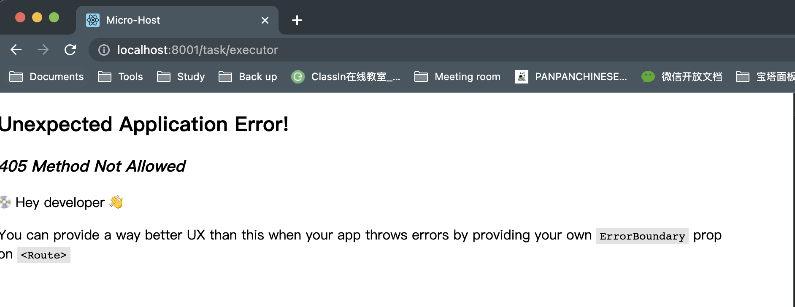
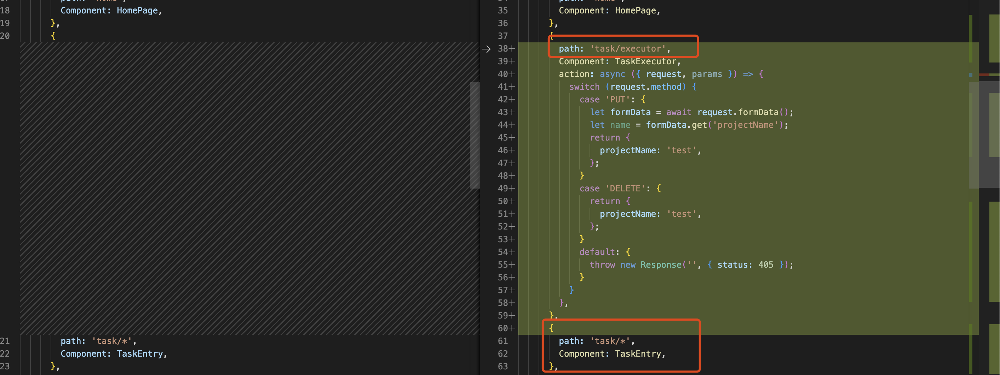

# Data Mutations

## 405 Method Not Allowed

其实出现这个问题的根本原因就是 action 对应的路由没有设置 action 属性，虽然从代码层面来看，我在子路由上面已经设置了 action 属性，但是其实这里由于父路由采用的是通配符方式，本次 submit 其实本以上是提交到了这个父路由，且因为父路由没设置 action 而报错，继而对路由进行了调整

### 修复方案

为了避免子路由下面所有的路由都可以接收 form 表单的数据，目前将指定的这个子路由单独设置，其他路由继续使用通配符，在子路由中进行设置，

> TODO: 继续关注是否可以通过其他动态子路由设置方案，以确保结合 MFE、不知晓子路由的情况该如何处理

